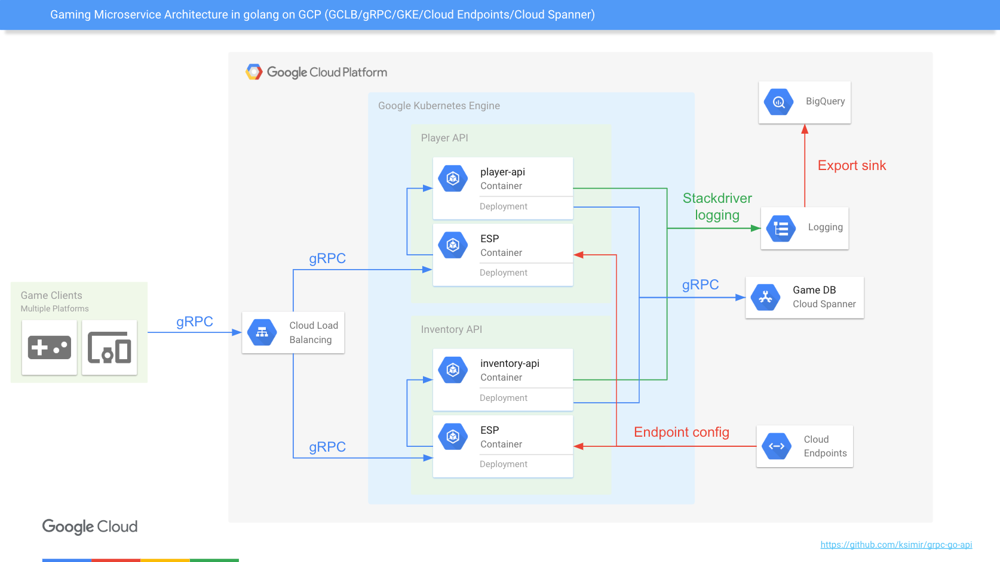

# Gaming Microservice Architecture (gRPC/Golang)
Sample Gaming Microservice gRPC APIs written in golang using Cloud Spanner on GCP (Google Cloud Platform) as storage layer. 
This sample uses GKE (Google Kubernetes Engine) on GCP to host the gRPC API server and use Cloud Endpoints to secure our API and GCLB (L7 LB - ingress in k8s) to load balance the service.



To get started with GCP, please follow this [link](https://cloud.google.com/gcp/getting-started/).

## Define your project ID:
```
export PROJECT_ID=$(gcloud config list project --format "value(core.project)")
```

## Build Docker image using as parameters your own GCP project info:
Update the below command with your own GCP Project ID as well as Cloud Spanner instance/database names.
```
$ docker build -t asia.gcr.io/${PROJECT_ID}/player-api:v1 .
$ docker build -t asia.gcr.io/${PROJECT_ID}/inventory-api:v1 .
```

## Then push the new Docker image to GCR (Google Container Repository):
```
$ gcloud docker -- push asia.gcr.io/${PROJECT_ID}/player-api:v1
$ gcloud docker -- push asia.gcr.io/${PROJECT_ID}/inventory-api:v1
```

## You can verify that the image has been successfully pushed using this commmand:
```
$ gcloud container images list-tags asia.gcr.io/${PROJECT_ID}/player-api
$ gcloud container images list-tags asia.gcr.io/${PROJECT_ID}/inventory-api
```

## Deploy the Web app to GKE (first deployment then service)

Replace `PROJECT_ID`, `INSTANCE`, `DATABASE` with your own GCP Project ID as well as your Cloud Spanner instance/db in the following config files:
- deployments/k8s/playerapi-deployment.yaml
- deployments/k8s/inventoryapi-deployment.yaml

```
$ kubectl create -f playerapi-deployment.yaml
$ kubectl create -f inventoryapi-deployment.yaml
$ kubectl create -f playerapi-service.yaml
$ kubectl create -f inventoryapi-service.yaml
```

## Check that the Deployments and Services are created
```
kubectl get deployments
kubectl get svc
```

## Test your gRPC API using the client app located in cmd/player-client-grpc folder
```
$ EXTERNAL-IP=$(kubectl get service player-service --output jsonpath="{.status.loadBalancer.ingress[0].ip}")
$ go run main.go --grpc-address=${EXTERNAL-IP} --grpc-port=8080
```

## Secure your gRPC API using Cloud Endpoints
To first deploy Cloud Endpoints config without authentication, use api_config.yaml config file.

Create a proto descriptor file
```
$ protoc --include_imports --include_source_info --descriptor_set_out deployments/endpoints/player-service/player.pb api/proto/v1/player.proto
$ protoc --include_imports --include_source_info --descriptor_set_out deployments/endpoints/inventory-service/inventory.pb api/proto/v1/inventory.proto
```

Replace `PROJECT_ID` with your own GCP Project ID in the following config files:
- deployments/endpoints/player-service/api_config.yaml
- deployments/endpoints/inventory-service/api_config.yaml
- deployments/k8s/playerapi-endpoints-deployment.yaml
- deployments/k8s/inventoryapi-endpoints-deployment.yaml

Deploy the Endpoints configuration
```
$ cd deployments/endpoints
$ gcloud endpoints services deploy player-service/player.pb player-service/api_config.yaml
$ gcloud endpoints services deploy inventory-service/inventory.pb inventory-service/api_config.yaml
```

Then delete and redeploy your gRPC pods and service using the Cloud Endpoints ESP sidecar container
```
$ kubectl delete deployment player-deployment
$ kubectl delete deployment inventory-deployment
$ kubectl delete svc player-service
$ kubectl delete svc inventory-service
$ kubectl create -f playerapi-endpoints-deployment.yaml
$ kubectl create -f playerapi-endpoints-service.yaml
$ kubectl create -f inventoryapi-endpoints-deployment.yaml
$ kubectl create -f inventoryapi-endpoints-service.yaml
```

If the deployment is successful, you can access the GCP Console and start seeing metrics from the Cloud Endpoints portal.

## Configuring a quota for the gRPC API
Redeploy the Cloud Endpoints config predefined for quotas (api_config_quota.yaml)
```
$ cd deployments/endpoints
$ gcloud endpoints services deploy player-service/player.pb player-service/api_config_quota.yaml
```

Follow the instructions [here](https://cloud.google.com/docs/authentication/api-keys#creating_an_api_key) to create a new API key.

Test your gRPC API quota using the created API key
Replace `API_KEY` in the following command

```
$ EXTERNAL-IP=$(kubectl get service player-service --output jsonpath="{.status.loadBalancer.ingress[0].ip}")
$ go run main.go \
    --grpc-address=${EXTERNAL-IP} \
    --grpc-port=8080 \
    --api-key=API_KEY
```

## Configuring service account authentication for the gRPC API
Redeploy the Cloud Endpoints config predefined for service account authentication (api_config_auth.yaml)
```
$ cd deployments/endpoints
$ gcloud endpoints services deploy player-service/player.pb player-service/api_config_auth.yaml
```

Follow the instructions [here](https://cloud.google.com/endpoints/docs/grpc/service-account-authentication#creating_the_consumer_service_account_and_key) to create a new service account.

Test your gRPC API using a service account
Replace `PROJECT_ID` and `SERVICE_ACCOUNT` in the following command

```
$ EXTERNAL-IP=$(kubectl get service player-service --output jsonpath="{.status.loadBalancer.ingress[0].ip}")
$ go run main.go \
    --grpc-address=${EXTERNAL-IP} \
    --grpc-port=8080 \
    --keyfile=SERVICE_ACCOUNT_KEY.json \
    --audience=player.endpoints.PROJECT_ID.cloud.goog
```

## Using a HTTP LB (ingress) to expose both gRPC services using managed SSL certificate

Step 1 - Create a global static IP address
```
$ gcloud compute addresses create ingress-ip --global
```

Step 2 - Create a managed SSL certificate (replace `API.DOMAIN.COM` by your own fqdn).
```
$ gcloud beta compute ssl-certificates create game-cert --domain API.DOMAIN.COM
```
> NOTE: the DNS record for your domain must reference the IP address you created at the previous step.
Otherwise you might get the error `FAILED_NOT_VISIBLE` for your managed SSL.
In my example, `API.DOMAIN.COM` DNS A record would point to the static IP generated during Step 1.

The following steps (3 & 4) are needed to enable SSL on ESP on Kubernetes.
For more details, please check https://cloud.google.com/endpoints/docs/grpc/enabling-ssl#ssl_keys_and_certificates

Step 3 - Any self-signed certificates seems to be ok so you can create the SSL key and certificate using OpenSSL
```
openssl req -x509 -nodes -days 365 -newkey rsa:2048 \
        -keyout ./nginx.key -out ./nginx.crt
```

Step 4 - Create a Kubernetes secret with your SSL key and certificate
```
$ kubectl create secret generic nginx-ssl \
     --from-file=./nginx.crt --from-file=./nginx.key
```
> FYI this k8s secret is used in the `playerapi-endpoints-ingress-deployment.yaml` and `inventoryapi-endpoints-ingress-deployment.yaml`

Step 5 - Clean up the previously deployed deployments and services
```
$ kubectl delete svc player-service
$ kubectl delete svc inventory-service
$ kubectl delete deployment playerapi-endpoints-deployment.yaml
$ kubectl delete deployment inventoryapi-endpoints-deployment.yaml
```

Step 6 - Finally redeploy the k8s deployments and services (updated to work with the HTTP LB) and deploy the HTTP LB to expose both gRPC APIs.

Replace `PROJECT_ID`, `INSTANCE`, `DATABASE` with your own GCP Project ID as well as your Cloud Spanner instance/db in the following config files:
- deployments/k8s/playerapi-endpoints-deployment.yaml
- deployments/k8s/inventoryapi-endpoints-deployment.yaml
```
$ kubectl create -f playerapi-endpoints-ingress-deployment.yaml
$ kubectl create -f playerapi-endpoints-ingress-service.yaml
$ kubectl create -f inventoryapi-endpoints-ingress-deployment.yaml
$ kubectl create -f inventoryapi-endpoints-ingress-service.yaml
$ kubectl create -f gameapi-ingress.yaml
```

Step 7 - Test your both gRPC APIs exposed by the HTTP LB (the gRPC path is used to route to the correct backend).
Replace `API.DOMAIN.COM` and `API_KEY` in the following command by the API key previously created
```
$ cd cmd/client-grpc
$ go run main.go \
    --grpc-address=API.DOMAIN.COM \
    --grpc-port=443 \
    --api-key=API_KEY
```
> Note that the test client (in `cmd/client-grpc`) only dials to the HTTP LB IP address once, the same gRPC connection is used to create a client for each gRPC API
